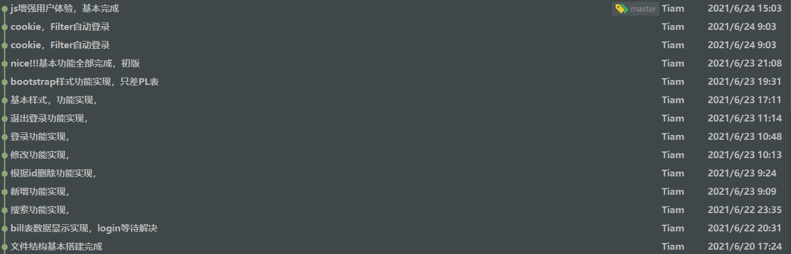
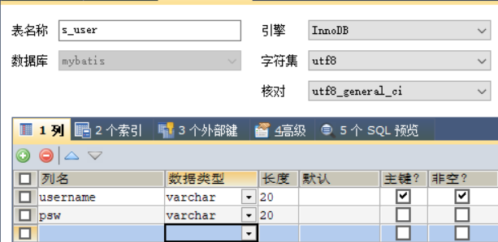
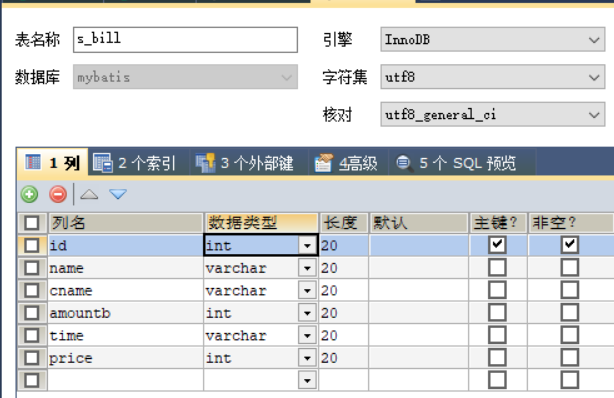
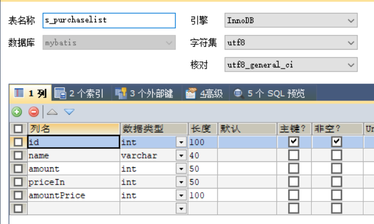

# 								WEB应用系统开发

### 																				—— 课程设计说明 
WEB课程设计--使用Servlet、jsp等技术实现的商家财务管理系统 

#### 																				姓名：余京

#### 																				信息学院 1909班

- Java web 

- 连接池druid

- servlet

- jsp

- Jquery

- 

  

@[TOC](store_web)

## 一、项目概述

### 1、账单管理系统项目简介

##### 账单信息管理系统的初始版本实现以下功能：

Ø 管理员登录

Ø 管理员退出

Ø 账单模糊查询（搜索框输入条件，出现所有符合条件的列表）

Ø 记录添加（Bill界面点击添加，出现账单添加页面，输入相关信息、提交保存）

Ø 进货单查看（账单浏览界面点击进货单导航栏，显示进货单列表）

Ø 进货商品添加（点击添加商品，出现商品添加页面，输入相关信息，提交保存）

Ø 进货商品模糊查询（进货单查询界面输入商品名，查询符合条件的商品，列表显示）

Ø 商品信息修改（点击对应商品的修改链接，出现修改界面，修改后保存）

Ø商品删除（点击对应商品的删除链接，弹出确认框，删除信息）



### 2、系统架构设计

##### 1、模型设计

User表

```java
public class User {
    private String username;
    private String psw;
}
```

Bill表

```java
public class Bill {
    private Integer id;//订单编号
    private String name;//商品名
    private String cname;//客户名
    private Integer amountb;//购买数量
    private String time;//购买时间
    private Integer price;//收款金额
}
```

PL表

```java
public class PurchaseList {
    private Integer id;//商品编号 主键 自增
    private String name;//商品名
    private Integer amount;//商品数量
    private Integer priceIn;//进货单价
    private Integer amountPrice;//总金额
}
```

##### 2、数据库设计

###### user表



###### bill表



###### PL表



## 二、功能实现

### 1、登录功能

| 用例名称：登陆                                               |
| :----------------------------------------------------------- |
| 用例标示编号：01                                             |
| 简要说明：登录到Bill表主界面                                 |
| 前置条件：处在用户登录界面                                   |
| 基本事件流：1. 用户填写用户名和密码；2. 点击登陆按钮；3.数据库查询校验；4、校验成功，跳转到主页 |
| 其它事件流：用户名或密码未输入，提醒账号或密码不能为空       |
| 异常事件流：校验账号密码失败，提醒用户名或密码错误           |
| 后置条件：无                                                 |

| 编号 | 类名或文件名      | 功能描述              |
| ---- | ----------------- | --------------------- |
| 1    | login.jsp         | 登录页面              |
| 2    | loginServlet.java | 处理登陆逻辑的servlet |
| 3    | IUserDaoImpl.java | 对接数据库的执行层    |

#### 运行效果图

.gif)

### 2、退出登录

| 用例名称：退出                                |
| :-------------------------------------------- |
| 用例标示编号：02                              |
| 简要说明：清除session与cookie，退出到登录界面 |
| 前置条件：处在用户界面                        |
| 基本事件流： 点击 注销 按钮                   |
| 其它事件流：无                                |
| 异常事件流：无                                |
| 后置条件：无                                  |

| 编号 | 类名或文件名               | 功能描述                     |
| ---- | -------------------------- | ---------------------------- |
| 1    | bill.jsp和purchaseList.jsp | 用户页面                     |
| 2    | logoutServlet.java         | 清除session和cookie的servlet |

#### 运行效果图

.gif)


### 3、Bill表查询功能

| 用例名称：查询                                               |
| :----------------------------------------------------------- |
| 用例标示编号：03                                             |
| 简要说明：通过商品名或客户名模糊查询                         |
| 前置条件：处在Bill表用户界面                                 |
| 基本事件流： 输入查询条件，点击查询，查询所有符合条件的结果； |
| 其它事件流：查询结果为空时，弹出提醒；查询条件为空时，查询所有。 |
| 异常事件流：无                                               |
| 后置条件：无                                                 |

| 编号 | 类名或文件名         | 功能描述              |
| ---- | -------------------- | --------------------- |
| 1    | bill.jsp             | Bill表用户页面        |
| 2    | SearchServlet_B.java | 处理查询逻辑的servlet |
| 3    | BillDaoImpl.java     | 对接数据库的执行层    |

#### 效果展示

.gif)

### 4、Bill表增添功能

| 用例名称：新增                                            |
| :-------------------------------------------------------- |
| 用例标示编号：04                                          |
| 简要说明：添加数据                                        |
| 前置条件：处在Bill表用户界面                              |
| 基本事件流： 点击添加按钮，弹出表单，填充数据，提交表单。 |
| 其它事件流：无                                            |
| 异常事件流：无                                            |
| 后置条件：无                                              |

| 编号 | 类名或文件名      | 功能描述              |
| ---- | ----------------- | --------------------- |
| 1    | bill.jsp          | Bill表用户页面        |
| 2    | addServlet_B.java | 处理新增逻辑的servlet |
| 3    | BillDaoImpl.java  | 对接数据库的执行层    |

#### 运行效果

.gif)

### 5、Bill表更新功能

| 用例名称：更新                                            |
| :-------------------------------------------------------- |
| 用例标示编号：05                                          |
| 简要说明：更新数据                                        |
| 前置条件：处在Bill表用户界面                              |
| 基本事件流： 点击修改按钮，弹出表单，修改数据，提交表单。 |
| 其它事件流：无                                            |
| 异常事件流：无                                            |
| 后置条件：无                                              |

| 编号 | 类名或文件名         | 功能描述              |
| ---- | -------------------- | --------------------- |
| 1    | bill.jsp             | Bill表用户页面        |
| 2    | updateServlet_B.java | 处理更新逻辑的servlet |
| 3    | BillDaoImpl.java     | 对接数据库的执行层    |

#### 运行效果

.gif)

### 6、Bill表删除功能

| 用例名称：删除                                               |
| :----------------------------------------------------------- |
| 用例标示编号：06                                             |
| 简要说明：删除数据                                           |
| 前置条件：处在Bill表用户界面                                 |
| 基本事件流： 点击删除按钮，弹出提示框，确定删除数据，取消关闭提示 |
| 其它事件流：无                                               |
| 异常事件流：无                                               |
| 后置条件：无                                                 |

| 编号 | 类名或文件名         | 功能描述              |
| ---- | -------------------- | --------------------- |
| 1    | bill.jsp             | Bill表用户页面        |
| 2    | deleteServlet_B.java | 处理删除逻辑的servlet |
| 3    | BillDaoImpl.java     | 对接数据库的执行层    |

#### 运行效果

.gif)


### 7、PL表查询功能

| 用例名称：查询                                               |
| :----------------------------------------------------------- |
| 用例标示编号：07                                             |
| 简要说明：通过商品名或客户名模糊查询                         |
| 前置条件：处在PL表用户界面                                   |
| 基本事件流： 输入查询条件，点击查询，查询所有符合条件的结果； |
| 其它事件流：查询结果为空时，弹出提醒；查询条件为空时，查询所有。 |
| 异常事件流：无                                               |
| 后置条件：无                                                 |

| 编号 | 类名或文件名         | 功能描述              |
| ---- | -------------------- | --------------------- |
| 1    | purchaseList.jsp     | PL表用户页面          |
| 2    | SearchServlet_P.java | 处理查询逻辑的servlet |
| 3    | PLDaoImpl.java       | 对接数据库的执行层    |

#### 效果展示

.gif)

### 8、PL表增添功能

| 用例名称：新增                                            |
| :-------------------------------------------------------- |
| 用例标示编号：08                                          |
| 简要说明：添加数据                                        |
| 前置条件：处在PL表用户界面                                |
| 基本事件流： 点击添加按钮，弹出表单，填充数据，提交表单。 |
| 其它事件流：无                                            |
| 异常事件流：无                                            |
| 后置条件：无                                              |

| 编号 | 类名或文件名      | 功能描述              |
| ---- | ----------------- | --------------------- |
| 1    | purchaseList.jsp  | PL表用户页面          |
| 2    | addServlet_P.java | 处理新增逻辑的servlet |
| 3    | PLDaoImpl.java    | 对接数据库的执行层    |

#### 运行效果

.gif)

### 9、PL表更新功能

| 用例名称：更新                                            |
| :-------------------------------------------------------- |
| 用例标示编号：09                                          |
| 简要说明：更新数据                                        |
| 前置条件：处在PLl表用户界面                               |
| 基本事件流： 点击修改按钮，弹出表单，修改数据，提交表单。 |
| 其它事件流：无                                            |
| 异常事件流：无                                            |
| 后置条件：无                                              |

| 编号 | 类名或文件名         | 功能描述              |
| ---- | -------------------- | --------------------- |
| 1    | purchaseList.jsp     | PL表用户页面          |
| 2    | updateServlet_P.java | 处理更新逻辑的servlet |
| 3    | PLDaoImpl.java       | 对接数据库的执行层    |

#### 运行效果

.gif)

### 10、PL表删除功能

| 用例名称：删除                                               |
| :----------------------------------------------------------- |
| 用例标示编号：10                                             |
| 简要说明：删除数据                                           |
| 前置条件：处在PL表用户界面                                   |
| 基本事件流： 点击删除按钮，弹出提示框，确定删除数据，取消关闭提示 |
| 其它事件流：无                                               |
| 异常事件流：无                                               |
| 后置条件：无                                                 |

| 编号 | 类名或文件名         | 功能描述              |
| ---- | -------------------- | --------------------- |
| 1    | purchaseList.jsp     | PL表用户页面          |
| 2    | deleteServlet_P.java | 处理删除逻辑的servlet |
| 3    | PLDaoImpl.java       | 对接数据库的执行层    |

#### 运行效果

.gif)


## 三、个人小结

### 1、系统实现的亮点、难点和不足

最大的亮点就是没啥亮点，简洁。基础不好，都比较难。不足就是不够安全。

好好学习，天天向上。


### 2、心得体会


​                实践出真知，理论是基础


